# Analyse statique d’un APK Android avec MobSF

## 1. Contexte du laboratoire

Ce laboratoire a pour objectif de réaliser une **analyse statique de sécurité d'une application Android (APK)** à l'aide de l'outil **MobSF (Mobile Security Framework)**.

L’analyse statique consiste à examiner la structure, la configuration, les permissions et le code d’une application **sans l’exécuter**, afin d’identifier des vulnérabilités potentielles.

Cette analyse permet de :

- comprendre l’architecture d’une application Android
- détecter des mauvaises configurations de sécurité
- identifier des surfaces d’attaque potentielles
- produire un **mini rapport d’audit de sécurité mobile**

---

# 2. Objectifs pédagogiques

Les objectifs de ce laboratoire sont :

- Comprendre le processus d'analyse statique d'un APK
- Identifier les composants sensibles d'une application Android
- Interpréter un rapport d'analyse de sécurité mobile
- Reconnaître les vulnérabilités courantes dans les applications Android
- Associer les vulnérabilités aux standards **OWASP MASVS**
- Formuler des recommandations de sécurité pertinentes
- Produire un mini rapport d'audit professionnel

---

# 2.1 Résumé exécutif 

L’analyse statique de l’application PizzaRecipes révèle un niveau de risque **moyen**.

Les principales vulnérabilités identifiées concernent :
- le mode debug activé
- l’utilisation d’un certificat de debug
- l’activation de la sauvegarde des données
- la présence de composants exportés

Aucune vulnérabilité critique liée au code ou aux communications réseau n’a été détectée.

---

# 3. Règles de sécurité et périmètre

Ce laboratoire s'inscrit dans un cadre **strictement pédagogique et légal**.

Il est autorisé d'analyser uniquement :

- l'APK pédagogique fourni par l'enseignant
- un APK généré à partir d’un projet de cours

Il est interdit d'analyser :

- des applications du Play Store
- des applications commerciales
- des applications propriétaires
- des applications système Android

L'objectif est uniquement :

- l'identification des risques de sécurité
- l'analyse de configuration
- la formulation de recommandations

Aucune exploitation des vulnérabilités identifiées n'est réalisée.

---

# 4. Environnement d'analyse

| Élément | Valeur |
|------|------|
OS | Kali Linux
Outil principal | MobSF
Version MobSF | 4.4.5
Type d'analyse | Analyse statique
APK analysé | app-debug.apk
Application | PizzaRecipes
Package | com.example.pizzarecipes
SHA256 | 8fd353dea4e2821743ad976ba1a4bc2209a94d5298aa44cb2cc7ffb1c7d1a23

---

# 5. Task 1 — Préparation de l’environnement d’analyse

## Création du dossier de travail

Un dossier dédié à l’analyse a été créé afin de garantir l’organisation et la traçabilité de l’audit.

Commande utilisée :
mkdir -p ~/apk_analysis/$(date +%Y-%m-%d)
cd ~/apk_analysis/$(date +%Y-%m-%d)

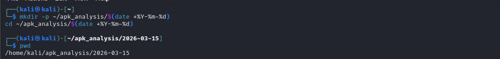

---

## Copie de l’APK dans le dossier d’analyse

L’APK à analyser est déplacé dans le dossier de travail.

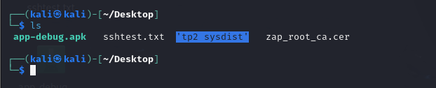

---

## Vérification de l’intégrité de l’APK

Le hash SHA256 de l’application est calculé.

Commande :
sha256sum app-debug.apk > apk_hash.txt
cat apk_hash.txt

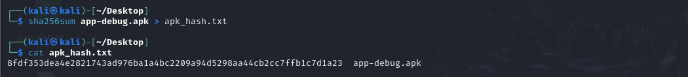

---

## Vérification de la taille du fichier

Commande :
ls -lh app-debug.apk

Capture :

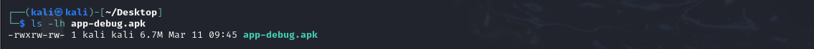

---

## Création du fichier de traçabilité

Un fichier contenant les informations d’analyse est créé.

Commande :
echo "Date d'analyse : $(date)" > analyse_info.txt
echo "Analyste : Hiba Lahrouf" >> analyse_info.txt
echo "VM : Kali Linux" >> analyse_info.txt
echo "APK analysé : app-debug.apk" >> analyse_info.txt
cat apk_hash.txt >> analyse_info.txt

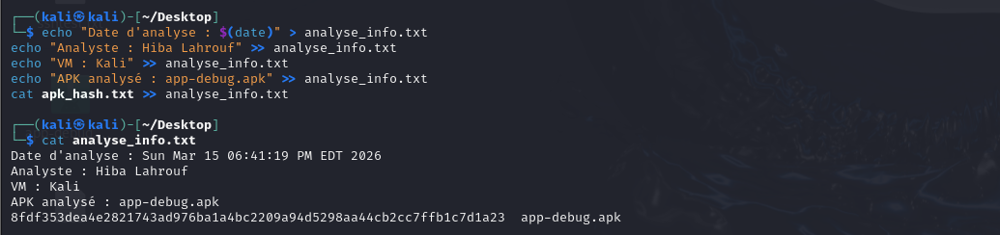

---

# 6. Task 2 — Lancement de MobSF

MobSF est lancé depuis le terminal.

Commande :
cd ~/Mobile-Security-Framework-MobSF
source .venv/bin/activate
./run.sh

MobSF démarre un serveur web local.

URL d'accès :
http://127.0.0.1:8000

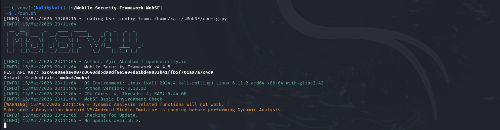

---

## Interface web MobSF

L’interface web permet d'importer un APK et de lancer l’analyse.

Capture :

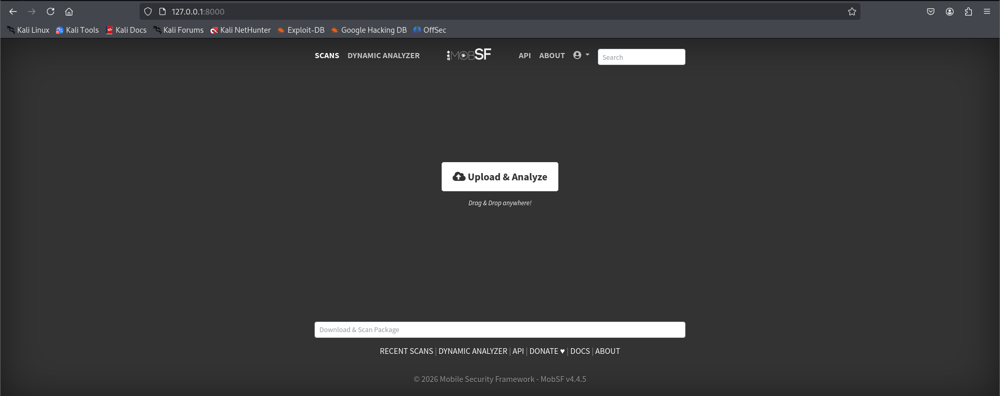

---

# 7. Task 3 — Import et analyse de l’APK

L’application est importée dans MobSF.

Étapes :

1. Cliquer sur **Upload & Analyze**
2. Sélectionner le fichier `app-debug.apk`
3. Lancer l'analyse

MobSF procède alors à :

- la décompilation de l’APK
- l’analyse du manifeste
- l’analyse des permissions
- la recherche de vulnérabilités

---
Temps d’analyse estimé : ~2 minutes

## Résultats de l’analyse

| Élément | Valeur |
|------|------|
Security Score | 36 / 100
Application | PizzaRecipes
Package | com.example.pizzarecipes
Version | 1.0
Min SDK | 24
Target SDK | 36

Capture :

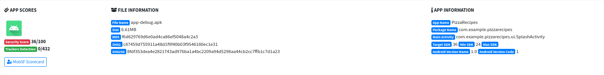

---

# 8. Task 4 — Analyse du manifeste Android

Le fichier **AndroidManifest.xml** contient la configuration principale de l'application.

Les paramètres de sécurité suivants ont été observés :
android:debuggable="true"
android:allowBackup="true"

Ces paramètres indiquent que l'application est en mode développement.

---

## Composants exportés

### Activity exportée
| Activity | Exported |
|---------|----------|
SplashActivity | Oui
ListPizzaActivity | Non
PizzaDetailActivity | Non

SplashActivity

Cette activité est exportée car elle contient l’intent :
MAIN
LAUNCHER

Capture :

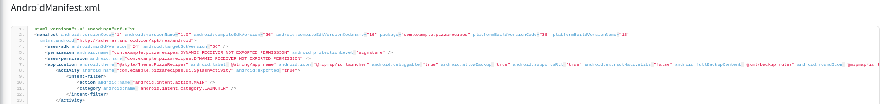

---

### Broadcast Receiver exporté

| Receiver | Exported |
|---------|----------|
ProfileInstallReceiver | Oui

androidx.profileinstaller.ProfileInstallReceiver

Capture :

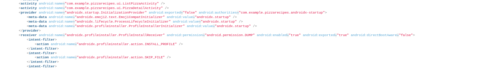
### Providers

| Provider | Exported |
|---------|----------|
InitializationProvider | Non

---

## Aperçu du manifeste

---

# 9. Task 5 — Analyse des permissions

MobSF indique que l’application ne demande **aucune permission Android dangereuse**.

Permission détectée :
com.example.pizzarecipes.DYNAMIC_RECEIVER_NOT_EXPORTED_PERMISSION

Cette permission est définie dans l’application avec le niveau :
protectionLevel="signature"

Cela signifie que seules les applications signées avec la même clé peuvent l’utiliser.

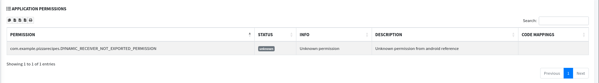

# 9.1 Analyse de la configuration réseau 
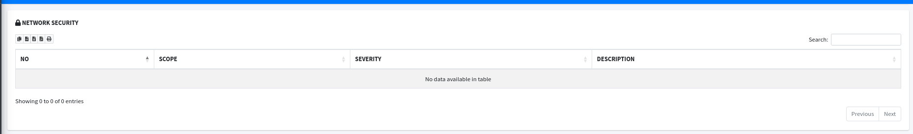

### Configuration réseau

- android:usesCleartextTraffic : non défini
- networkSecurityConfig : absent

### Interprétation

L’absence de `usesCleartextTraffic` indique que l’application n’autorise pas explicitement le trafic HTTP non sécurisé.

Sur Android moderne (API ≥ 28), cela signifie que seul le trafic HTTPS est autorisé par défaut.

---

### Analyse des endpoints
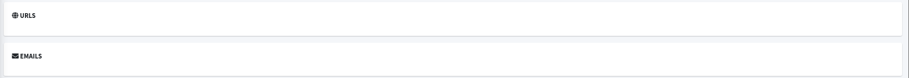

Résultat MobSF :

- Aucun URL détecté
- Aucun endpoint
- Aucun email

---

### Conclusion réseau

Aucune communication réseau sensible ou non sécurisée n’a été identifiée.

---

# 10. Task 6 — Analyse du code et des ressources

L’analyse du code n’a révélé :

- aucun secret hardcodé
- aucune clé API exposée
- aucune URL sensible
- aucun endpoint critique

Les sections suivantes n’ont signalé aucun problème :

- Code Analysis
- Shared Library Analysis
- File Analysis
- Firebase Analysis
- 
- 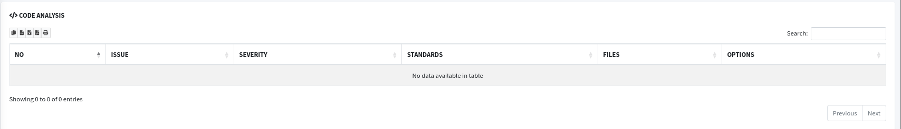
- 
# 10.1 Surface d’attaque 

Les points d’entrée potentiels identifiés sont :

- Activity exportée (SplashActivity)
- Broadcast Receiver exporté
- Mode debug activé
- Sauvegarde des données activée

---

# 11. Task 7 — Corrélation avec OWASP MASVS

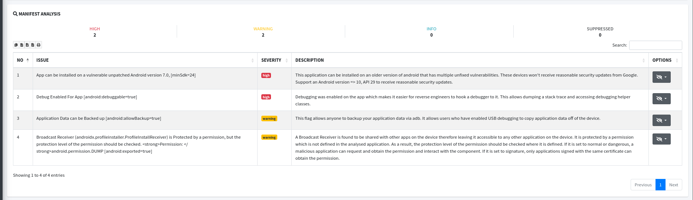

Les vulnérabilités identifiées peuvent être associées au standard **OWASP MASVS**.

### Debug activé

Catégorie :
MASVS-RESILIENCE

Les builds de production ne doivent pas être débogables.

---

### Certificat debug

Catégorie :
MASVS-CODE

Les applications doivent être signées avec un certificat sécurisé.

## Tests MASTG complémentaires

- MASTG-TEST-0011 : Vérification du mode debug
- MASTG-TEST-0024 : Analyse des composants exportés

---

# 12. Task 8 — Export du rapport MobSF

MobSF permet d’exporter le rapport d’analyse.

Depuis l’interface :
Generate PDF Report

Le rapport contient :

- score de sécurité
- vulnérabilités détectées
- analyse du manifeste
- analyse du certificat
- recommandations automatiques

---
# 12.1 Analyse des faux positifs 

Aucune vulnérabilité critique n’a été identifiée comme faux positif.

Les résultats fournis par MobSF sont cohérents avec la configuration du manifeste.

---

# 13. Vulnérabilités identifiées

## 1. Application signée avec un certificat debug

Sévérité : HIGH

Description :

L’application est signée avec un certificat de debug Android.

Impact :

- modification de l’application possible
- reverse engineering facilité
- signature facilement reproduite

Remédiation :

Signer l’application avec un **certificat de production sécurisé**.

---

## 2. Mode debug activé

Sévérité : HIGH

Preuve :
android:debuggable="true"

Impact :

Un attaquant peut attacher un debugger et analyser l’application.

Remédiation :
android:debuggable="false"

---

## 3. Sauvegarde des données activée

Sévérité : WARNING

Preuve :
android:allowBackup="true"

Impact :

Extraction possible des données via ADB backup.

Remédiation :
android:allowBackup="false"

---

## 4. Broadcast Receiver exporté

Description :

Le receiver `ProfileInstallReceiver` est exporté mais protégé par une permission système.

Impact :

- Surface d’attaque limitée
- Accès restreint mais toujours exposé

---

Sévérité : WARNING

Remédiation :

Limiter les composants exportés ou ajouter des permissions restrictives.

---

# 14. Observations positives

- Aucune permission Android dangereuse
- Aucun secret hardcodé
- Aucun endpoint exposé
- Aucun stockage sensible détecté
- Aucun problème dans le code natif

---

# 15. Évaluation du risque global

Score MobSF :
36 / 100

Niveau de risque estimé :
MEDIUM

Justification :

Les vulnérabilités détectées sont principalement liées à une configuration de développement.

---

# 16. Recommandations

1. Désactiver le mode debug en production
2. Signer l’application avec un certificat sécurisé
3. Désactiver la sauvegarde des données
4. Restreindre les composants exportés
5. Augmenter la version Android minimale supportée

---

# 17. Conclusion

L’analyse statique de l’application **PizzaRecipes** révèle plusieurs faiblesses de configuration typiques d’une application en environnement de développement.

Ces vulnérabilités doivent être corrigées avant une mise en production afin de réduire la surface d’attaque et améliorer la sécurité globale de l’application.

---

# 18. Outils utilisés

MobSF  
Kali Linux  
Android SDK  
OWASP MASVS
# 19. Annexes 

## Permissions

- com.example.pizzarecipes.DYNAMIC_RECEIVER_NOT_EXPORTED_PERMISSION

## Composants exportés

- SplashActivity
- ProfileInstallReceiver

## Endpoints

Aucun endpoint ou URL détecté
# Fichiers de traçabilité générés

Les fichiers suivants ont été créés pour structurer l’analyse :

- analyse_info.txt
- permissions.txt
- composants_exportes.txt
- config_reseau.txt
- endpoints.txt
- vulnerabilites.txt
- ressources_sensibles.txt
- correlation_masvs.txt
- top_vulnerabilites.txt
